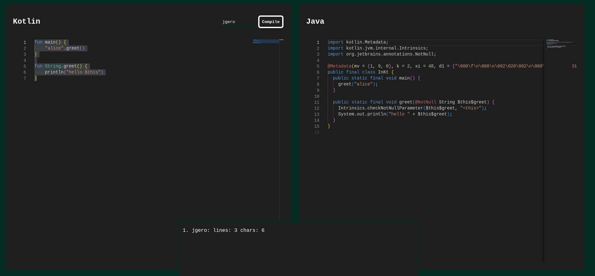

# Kotlin to Java compression calculator

At work we started a new product in Kotlin, and to demonstrate my colleagues who
come form a Java background how much more compact Kotlin is in comparison I
created this converter tool. You put in Kotlin code on one side, and the tool
will output the corresponding Java code on the other side.

Additionally it will show you the compression ratio of the Kotlin code compared
to the Java code. To make it a bit more fun it also contains a scoreboard to
have a kind of competition which Kotlin features would be the most verbose in
Java.

## Idea

This server compiles Kotlin code, de-compiles it to Java and then compares the
character count.

1. compile Kotlin: `kotlinc test.kt`
2. de-compile to Java: `jd-cli TestKt.class`

## Develop

The nix develop shell has all necessary tools installed. Start the Golang dev
server in it with `dev-server`.

## Release

On every push to master a CI pipeline is triggered which builds the docker
image, which is also built by nix to be as minimal as possible.

